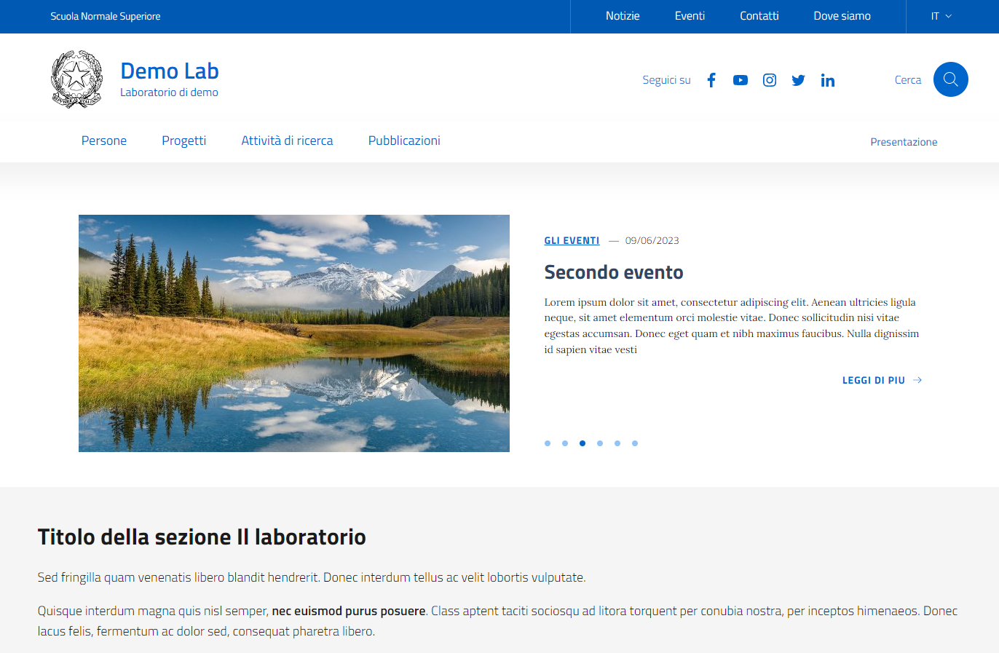

a#  Design Laboratori Italia


**Design laboratori e centri di ricerca** è un tema wordpress basato sul modello di siti per le scuole italiane e sviluppato dalla ***Scuola Normale Superiore*** con l’obiettivo di creare un modello di sito per le strutture di ricerca (centri e laboratori).  Una volta istallato, l'ambiente offre una serie di contenuti predefiniti che rendono semplice e veloce l'allestimento del sito. Questo sito permette di pubblicare tutte le informazioni relative ad una struttura di ricerca: personale afferente organizzato per struttura, pubblicazioni, progetti di ricerca, attività di ricerca (aggregazione di progetti) oltre a news ed eventi correlati alle attività. 
Il progetto si  pone l'obiettivo di obiettivo di dare evidenza e valore alle attività e al personale di ricerca delle strutture.
## Stato del progetto
Il progetto è in fase di beta testing.

## Credits
Il progetto nasce da un fork del tema [**Design Scuole Italia**](https://developers.italia.it/it/software/istsc_blps020006-italia-design-scuole-wordpress-theme.html) ed utilizza la libreria [***Bootstrap Italia 2.12.0***](https://italia.github.io/bootstrap-italia/). Tutti i plugin e le librerie utilizzate dal tema sono elencate nel file [CREDITS.txt](https://github.com/ScuolaNormaleSuperiore/design-laboratori-wordpress-theme/blob/main/CREDITS.txt).

## Funzionalità
- Popolamento automatico del sito (pagine e menu).
- Sezione per la configurazione del tema e dei contenuti.
- Personalizzazione del layout della home page.
- Gestione delle persone del laboratorio.
- Gestione dei progetti del laboratorio.
- Gestione delle news e degli eventi del laboratorio.
- Gestione dei luoghi del laboratorio.
- Gestione delle pubblicazioni del laboratorio.
- Gestione degli indirizzi di ricerca.
- Gestione dei brevetti del laboratorio.
- Gestione del blog del laboratorio.
- Pagine di archivio con paginazione.
- Ricerca in tutti i contenuti del sito.
- Gestione degli avvisi in home page.
- Gestione dei cookies.
- Form di contatti.
- Mappa del sito.
- Gestione hero in home page.
- Carousel in home page con contenuti selezionabili.
- Gestione contenuti in evidenza in home page.
- Gestione sezioni eventi, news e pubblicazioni in home page.
- Gestione banner in home page.
- Supporto delle lingue italiano ed inglese.
- Integrazione con il software di gestione delle newsletter Brevo.
- Importazione degli eventi da Indico.
- Importazione dei brevetti da IRIS.


## Requisiti software
1. Il CMS Wordpress (versione >= 6.1.1).


## Repository
[Questo](https://github.com/ScuolaNormaleSuperiore/design-laboratori-wordpress-theme) è il repository che contiene il codice sorgente del progetto.

## Catalogo del riuso
Il progetto è pubblicato sul catalogo del riuso di Developers Italia. La home page del progetto è [questa](https://developers.italia.it/it/software/sns_pi-scuolanormalesuperiore-design-laboratori-wordpress-theme.html).


## Documentazione
Il *Manuale operatore* è in fase di realizzazione.
Lo schema dei tipi di contenuto e delle tassonomie introdotte dal tema si trovano nel documento: [Schema-Contenuti-SitoFederato.pdf](https://github.com/ScuolaNormaleSuperiore/design-laboratori-wordpress-theme/tree/main/DOC/Schema-Contenuti-SitoFederato.pdf).
La procedura per aggiornare la versione usata di Bootstrap Italia è nel documento: [HowTo Aggiornare Bootstrap Italia.md](https://github.com/ScuolaNormaleSuperiore/design-laboratori-wordpress-theme/tree/main/DOC/HowTo Aggiornare Bootstrap Italia.md).

## Siti d'esempio
Esiste un sito di test che serve a mostrare le principali funzionalità del sistema:
* [Sito Federato DEV](https://sitofederato-dev.sns.it)
  
Alcuni siti in produzione realizzati con questo tema:
* <a href="https://istitutociampi.sns.it" target="_blank">Istituto di Studi Avanzati "Carlo Azeglio Ciampi"</a>
* <a href="https://kto.sns.it" target="_blank">POCKET - Knowledge Transfer Office</a>
* <a href="https://edevpro3.sns.it" target="_blank">EDEV PRO 3</a>

## Demo
### Docker
E' possibile provare il tema usando un container *Docker* che contiene tutte le componenti software richieste (Wordpress + tema + plugins + contenuti d'esempio). 
Il Dockerfile da usare è: [Dockerfile](https://github.com/ScuolaNormaleSuperiore/design-laboratori-wordpress-theme/tree/main/DEV/Docker/Dockerfile).

Il sito di prova fa riferimento ad un laboratorio di esempio chiamato **Demo Lab** è già configurato ed è popolato con dei contenuti di prova. Lo scopo di Demo Lab è quello di mostrare le funzionalità del sistema e poterle provare velocemente, non deve essere usato in ambienti di produzione.

I comandi da eseguire per creare ed eseguire il container sono:
- docker build -t demolab-img -f Dockerfile .
- docker run -p 80:80 -p 3306:3306 --name=demolab -d demolab-img
 
Per collegarsi alla shell del container, eseguire il comando:
- docker exec -it demolab /bin/bash
  
L'url del sito appena creato è: http://localhost/ .

Per autenticarsi come amministratore del sito l'url è http://localhost/wp-admin/ e l'account per accedere è: manager / password

Sul container è installato il tool *Adminer* per gestire le tabelle del database.
L'url di *Adminer* è: http://localhost/adminer.php
Per configurarlo i parametri sono:
- System: Mysql
- Server: 127.0.0.1
- Utente: admin
- Password: admin
- Database: demolabdb


## Dipendenze
Per il corretto funzionamento del tema è necessario installare i seguenti plugin:
* [ACF OpenStreetMap Field](https://wordpress.org/plugins/acf-openstreetmap-field/)
* [Advanced Custom Fields](https://wordpress.org/plugins/advanced-custom-fields/)
* [Better Aria Label Support](https://wordpress.org/plugins/better-aria-label-support/)
* [CookieYes](https://it.wordpress.org/plugins/cookie-law-info/)
* [Polylang](https://it.wordpress.org/plugins/polylang/)
* [WP Mail SMTP](https://it.wordpress.org/plugins/wp-mail-smtp/)
* [Really Simple CAPTCHA](https://it.wordpress.org/plugins/really-simple-captcha/)

Il tema mostra un avviso quando uno di questi plugin non è installato.

## Ruoli e permessi
Installando il tema viene aggiunto un ruolo chiamato **Super Editor** che ha gli stessi permessi di un Editor, con i più il permesso di configurare il plugin (WP->Configurazione) e quello di modificare il menu del tema (WP->Aspetto).

## Installazione e configurazione del tema
Dopo aver installato WordPress su un server, per installare e configurare il tema **Design laboratori e centri di ricerca** è necessario seguire i seguenti passi:

1. Scaricare il tema ["Design Laboratori Italia"](https://github.com/ScuolaNormaleSuperiore/design-laboratori-wordpress-theme.git).
2. Copiare la cartella ***design-laboratori-wordpress-theme*** in *<installazione_wordpress>/wp-content/themes/*
3. Attivare il tema (creazione automatica dei contenuti e dei menu di default).
4. Installare e attivare i plugin dipendenti (un popup mostra l'elenco dei plugin richiesti).
5. Configurazione di Polylang usando il wizard del plugin:

	5.1 Andare in *WP->Lingue->Configurazione* e aggiungere le lingue italiano (default) e inglese.

	5.2 Impostare: *Permetti a Polylang di tradurre i media*.

	5.3 Impostare *Scegli la lingua da assegnare* = it.

6. Creazione dei contenuti di default: *WP->Aspetto->Ricarica i dati-> Ricarica i dati di attivazione (menu, pagine, tassonomie, etc)*
7. In *WP->Aspetto->Menu* cliccare su **Salva menu**.
8. Configurazione del tema: Andare in *WP->Configurazione* e impostare i dati di configurazione.
**Immagine 1:** Backoffice: configurazione del tema.


## Personalizzazione dello stile (colori e font)
In *WP->Configurazione->Altro->Stile del sito* è possibile scegliere tra:
* **Stile Bootstrap Iatalia standard**: Stile che prevede i colori e i font di default della libreria Bootstrap Italia.
* **Stile personalizzato**: Stile che usa colori e font personalizzati presi dai file [bootstrap-italia-custom.min.css](assets/scss/bootstrap-italia-custom.min.css) e [custom-colors.css](assets/css/custom-colors.css).

Il file  [bootstrap-italia-custom.min.css](assets/scss/bootstrap-italia-custom.min.css) può essere prodotto con la procedura descritta nel documento [Personalizzazione della libreria](https://italia.github.io/bootstrap-italia/docs/come-iniziare/personalizzazione-della-libreria/) oppure seguendo i seguenti passi:

1. Entrare con la shell nella directory principale del template: ***design-laboratori-wordpress-theme***.
2. Eseguire il comando ***npm install*** in modo che venga prodotta la cartella *node-modules* con tutte le dipendenze del caso.
3. Modificare il file [boostrap-italia.scss](assets/scss/bootstrap-italia-custom.scss) indicando i valori che devono essere modificati e rigenerati.
4. Eseguire il comando ***npm run update_layout_win*** o ***npm run update_layout_linux***. Questo comando produce un nuovo file *bootstrap-italia-custom.min* che va a sovrascrivere quello esistente.

Altre guide su questo argomento:
* [Personalizzazione della libreria](https://italia.github.io/bootstrap-italia/docs/come-iniziare/personalizzazione-della-libreria).
* [Elenco delle variabili modificabili](https://github.com/italia/bootstrap-italia/tree/main/src/scss).
* [Tool per codifica colori](https://rgb.to/).
* [Google Fonts](https://fonts.google.com).

## Tickets e bug-fixing
Per segnalare dei bug utilizzare la sezione [Issues](https://github.com/ScuolaNormaleSuperiore/design-laboratori-wordpress-theme/issues) del repository del progetto.

## Sviluppi futuri
Queste le sono le principali funzionalità previste per le prossime versioni del sistema:
* Integrazione con il software Iris.
* Autenticazione degli operatori tramite LDAP.
* Autenticazione degli operatori tramite Shibboleth.

## Verifica file publiccode.yml
Il file ***publiccode.yml*** serve per la pubblicazione del progetto nel [catalogo del riuso](https://developers.italia.it/it/software/sns_pi-scuolanormalesuperiore-design-laboratori-wordpress-theme.html). Per verificare la sua correttezza si può usare questa [procedura](https://github.com/italia/publiccode-parser-go).
```
go install github.com/italia/publiccode-parser-go/v4/publiccode-parser@latest
cd <root_cartella_plugin>
publiccode-parser publiccode.yml
```

## Galleria

**Immagine 1:** Backoffice: configurazione del carousel.


**Immagine 2:** Homepage con carousel.


**Immagine 3:** Le persone del laboratorio.


**Immagine 4:** I progetti del laboratorio.


**Immagine 5:** La ricerca nel sito.


## Lingue supportate
Il tema è disponibile in ***italiano*** e in ***inglese***.

## Copyright
1. Detentore copyright: *Scuola Normale Superiore*.
2. Responsabili del progetto: Michele Fiaschi, Marcella Monreale e Claudio Battaglino.
3. Il progetto è stato realizzato con la collaborazione dell'***Ufficio comunicazione*** e Monia Manescalchi del ***laboratorio Doc Star*** della *Scuola Normale Superiore*.
